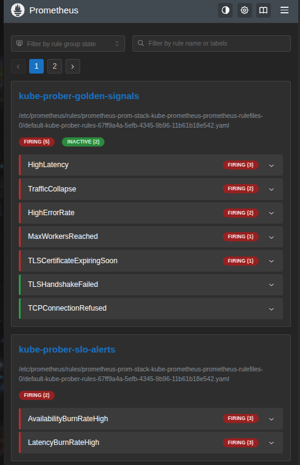
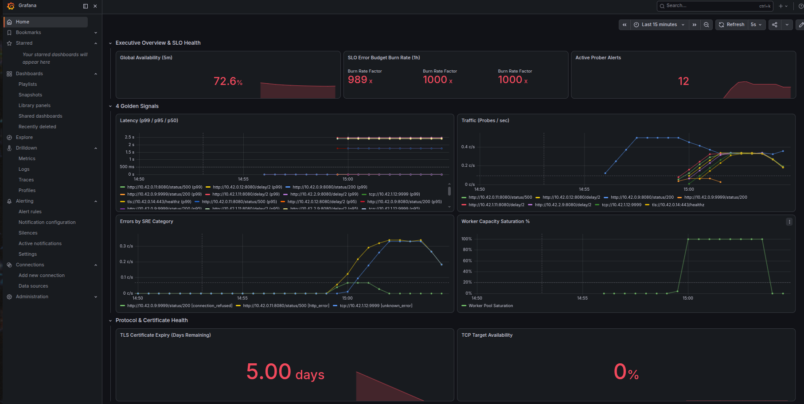
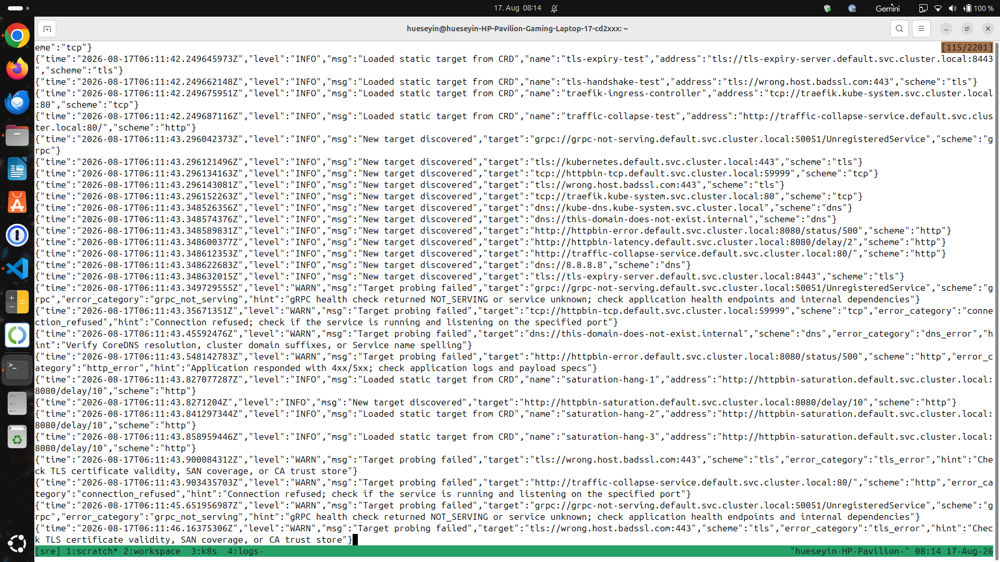

# kube-prober

[](https://github.com/demirdilek/kube-prober/actions/workflows/ci.yml)
[](https://opensource.org/licenses/MIT)
[](https://github.com/demirdilek/kube-prober)
[](https://github.com/demirdilek/kube-prober/pkgs/container/kube-prober)

`kube-prober` is a lightweight Kubernetes-native probing controller written in Go. It dynamically discovers endpoints via Kubernetes `EndpointSlices` using a `SharedInformer` and performs health and performance probes using a concurrency-safe worker pool. Metrics (4 Golden Signals) and lifecycle endpoints are exposed for Prometheus integration.

---

## 📦 Container Image Specs

- **Registry:** `ghcr.io/demirdilek/kube-prober:latest`
- **Base Image:** `scratch` (Minimalist & secure zero-OS runtime)
- **Architecture:** Multi-Arch (`amd64` / `arm64`)

---

## Key Features

- **Event-Driven Target Discovery:** Uses Kubernetes `discoveryv1.EndpointSlice` Informers (filtered by `probe: "true"`) to dynamically discover endpoints without high-overhead API polling.
- **Multi-Protocol Health Probing:** Native probing handlers for **HTTP/HTTPS**, **TCP**, **TLS** (cert expiry & handshake), and **gRPC** (`grpc.health.v1.Health`). Protocol schemes and custom paths are configurable via Service annotations (`probe/scheme`, `probe/path`).
- **Multi-Tier SRE Error Classification & Hints:** Categorizes network/protocol failures into distinct SRE buckets (`dns_error`, `tls_error`, `grpc_not_serving`, etc.) and attaches actionable diagnostic hints to metrics and alerts to lower MTTR.
- **Multi-Channel Alerting (Slack & Pushover):** Pre-configured Alertmanager routing featuring ChatOps audit trails in Slack and high-priority mobile push notifications via Pushover for `critical` incidents.
- **Distributed Target Sharding (Rendezvous Hashing):** Scales horizontally with Kubernetes HPA by partitioning target endpoints across prober replicas using Highest Random Weight (HRW) hashing, preventing duplicate probes.
- **SLO / SLI & Burn Rate Alerting:** Computes real-time Availability (99.9%) and Latency SLIs via Prometheus Recording Rules with multi-window burn rate alerts (1h / 5m).
- **Production-Grade High Availability & Lifecycles:** Features `PodDisruptionBudget` (PDB), `HorizontalPodAutoscaler` (HPA), Topology Spread Constraints, native `/healthz` & `/readyz` K8s probes, and graceful shutdown signal handling (`SIGTERM`).
- **GitOps Continuous Delivery & Telemetry Stack:** Managed declaratively via Argo CD with auto-provisioned Grafana dashboards and Prometheus rules.

---

## Tech Stack & Architecture

- **Go (Golang):** Core microservice architecture featuring native API probing and Prometheus instrumentation.
- **Kubernetes:** Event-driven target discovery utilizing modern `discoveryv1.EndpointSlice` Kubernetes Informers.
- **Argo CD:** GitOps controller executing continuous delivery and automated cluster state synchronization.
- **Prometheus & Grafana:** Full observability stack measuring the 4 Golden Signals.
- **Alertmanager:** Production-ready alert routing with severity classification (`warning`, `critical`).

---

## Architecture Overview

The `kube-prober` microservice acts as the central observability engine. Using a Kubernetes Informer, it streams target changes directly from the API server into a local, thread-safe memory registry before executing HTTP/DNS probes and exporting 4 Golden Signals telemetry.

```text
                                                  +--------------------+
                                                  | Cluster Autoscaler |
                                                  +---------+----------+
                                                            |
[ K8s Control Plane ] --(EndpointSlice Watch Stream)--> [ kube-prober Informer ]
   |                                                        |
   +--(HPA / PDB Supervision)-----------------> (Thread-Safe Local Registry)
                                                            |
                                               (Concurrent HTTP/DNS Probes)
                                                            v
                                                   [ Target Services ]
                                                            |
                                                   (Prometheus Metrics)
                                                            v
                                                      [ Prometheus ]
                                                            |
                                                       (Alert Rules)
                                                            v
                                                      [ Alertmanager ]
                                                            |
                                                 (Webhooks / Slack / Push)
                                                            v
                                                      [ SRE On-Call ]
```

---

## 🛡️ High Availability & Resilience Architecture

`kube-prober` follows SRE production-readiness guidelines across 4 core resilience pillars:

| Resilience Pillar | Target Risk | Mechanism / Implementation |
| :--- | :--- | :--- |
| **1. Planned Maintenance** | Outages during node upgrades / drains | **PodDisruptionBudget (PDB):** Prevents evictions if available replicas fall below `minAvailable` threshold. |
| **2. Dynamic Traffic Surges** | Resource exhaustion and high latency | **HorizontalPodAutoscaler (HPA):** Auto-scales prober replicas from 2 to 10 instances based on CPU/Memory load. |
| **3. Hardware / Node Failures** | Single Point of Failure (SPOF) on node level | **TopologySpreadConstraints:** Forces Kubernetes scheduler to evenly distribute pods across distinct physical nodes (`maxSkew: 1`). |
| **4. Application Health** | Deadlocks, premature traffic, data loss | **Probes & Graceful Shutdown:** Native `/healthz` & `/readyz` probes coupled with Go `SIGTERM` context signal cancellation. |
| **5. Multi-Replica Scaling** | Duplicate probing and uneven load distribution | **Target Sharding:** Rendezvous Hashing dynamically distributes ownership of endpoints across active prober peers. |

---

## Project Structure

```text
.
├── .github/
│   └── workflows/          # GitHub Actions CI/CD & Linting Pipelines
├── assets/                 # Dokumentations-Screenshots & Grafiken
├── deploy/
│   └── argocd/             # Argo CD Application Manifests (GitOps)
├── helm/
│   └── kube-prober/        # Helm Chart (Deployment, RBAC, PrometheusRule, Dashboards)
│       ├── dashboards/     # Auto-provisionierte Grafana Dashboards
│       └── templates/      # Kubernetes Ressourcen & Alerting-Regeln
├── pkg/
│   ├── env/                # Environment-Parsing & Konfigurations-Utilities
│   ├── kube/               # Kubernetes Client Initialization & Fallback
│   ├── prober/             # Core Probing Engine (HTTP, TCP, TLS, gRPC), Informer & Metrics
│   └── server/             # Telemetrie & Health HTTP Server (/metrics, /healthz, /readyz)
├── scripts/
│   └── alerts/             # Shell-Skripte zur Simulation von Golden Signals & Alert-Tests
├── Dockerfile              # Multi-stage, Multi-arch Build File
├── Makefile                # Lifecycle Automatisierung (k3d, Build, Helm, Alert-Tests)
├── main.go                 # Microservice Entry Point & Dependency Injection
├── go.mod                  # Go Modul- & Abhängigkeitsdefinitionen
└── prom-stack-values.yaml  # Prometheus Stack & Alertmanager Routing Konfiguration
```

---

## Getting Started

### Prerequisites

- Docker / Buildx
- k3d / Kubernetes
- Helm 3+
- GNU Make

---

## Local Cluster Lifecycle & Deployment

You can manage the local development cluster and the entire stack lifecycle using the provided `Makefile`:

```bash
# Spin up the entire stack from scratch (k3d, Docker build, Prometheus, Argo CD, Helm deployment)
make all

# Fast local rebuild, import, pause GitOps auto-sync, and rollout restart for local debugging
make local-deploy

# Pause Argo CD Auto-Sync & Self-Healing for local debugging
make dev-enable

# Re-enable Argo CD Auto-Sync & Self-Healing
make dev-disable

# Delete local k3d cluster and clean up local artifacts
make clean

# Start background port-forwarding for Argo CD (8080), Prometheus (9090), and Grafana (3000)
make forward-all

# Stop background port-forwarding
make stop-forward

# Run unit and integration tests with the race detector enabled
make test
```


---

## Observability & Dashboards

The Grafana dashboard is **fully auto-provisioned out of the box** via the Prometheus Operator sidecar mechanism (`grafana_dashboard: "1"`), requiring zero manual JSON imports or configuration. It visualizes real-time telemetry for all 4 Golden Signals: Latency, Traffic, Errors, and Saturation.

Once background port-forwarding is active (`make forward-all`), access the Control Plane UIs via your browser or Tailscale network:

- **Argo CD:** [https://localhost:8080](https://localhost:8080) or [https://<TAILSCALE_IP>:8080](https://<TAILSCALE_IP>:8080)
- **Prometheus:** [http://localhost:9090](http://localhost:9090) or [http://<TAILSCALE_IP>:9090](http://<TAILSCALE_IP>:9090)
- **Grafana:** [http://localhost:3000](http://localhost:3000) or [http://<TAILSCALE_IP>:3000](http://<TAILSCALE_IP>:3000)

| Argo CD Control Plane | Prometheus Target Telemetry |
| :---: | :---: |
|  |  |

| Grafana 4 Golden Signals Dashboard | Structured Slog Output |
| :---: | :---: |
|  |  |

---

## Alerting & Escalation

Real-time telemetry evaluation is managed via Prometheus Alertmanager based on defined thresholds for the 4 Golden Signals. Alerts are pre-classified by severity (`warning` vs. `critical`) and can be seamlessly routed to Webhooks, PagerDuty, Opsgenie, or Slack.

---

### Simulating Alerts

The setup allows you to simulate threshold violations for different Golden Signals and protocol handlers out of the box using `make`:

| Alert Scenario | Description / Target | Trigger Command |
| :--- | :--- | :--- |
| **High Latency** | Injects 2s delay (`/delay/2`) to breach p99 latency | `make test-alert-latency` |
| **High Error Rate** | Deploys HTTP 500 internal server error target | `make test-alert-error` |
| **Traffic Collapse** | Simulates transport outage via misrouted service port | `make test-alert-traffic` |
| **Worker Saturation** | Drossels worker pool (`WORKERS=2`) under heavy load | `make test-alert-saturation` |
| **TCP Connection Refused** | Targets dead port (Layer 4 failure) | `make test-alert-tcp` |
| **TLS Cert Expiry / Handshake** | Deploys expiring self-signed certificate | `make test-alert-tls-expiry` |
| **gRPC Service Failure** | Targets gRPC endpoint without `grpc.health.v1` | `make test-alert-grpc` |

#### 🧹 Cleanup

To teardown all simulated targets and restore the prober baseline, run:

```bash
make test-alert-clean
```

### Multi-Channel Alert Routing Matrix

| Slack Audit Trail (`#alerts`) | Pushover Detailed View |
| :---: | :---: |
|  |  |  

---

### Roadmap & Production Readiness

Check out our [ROADMAP.md](ROADMAP.md) for planned features, upcoming architectural refinements, and production readiness milestones.
